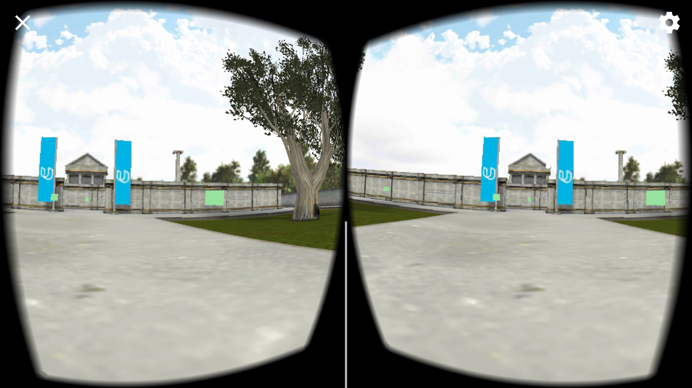
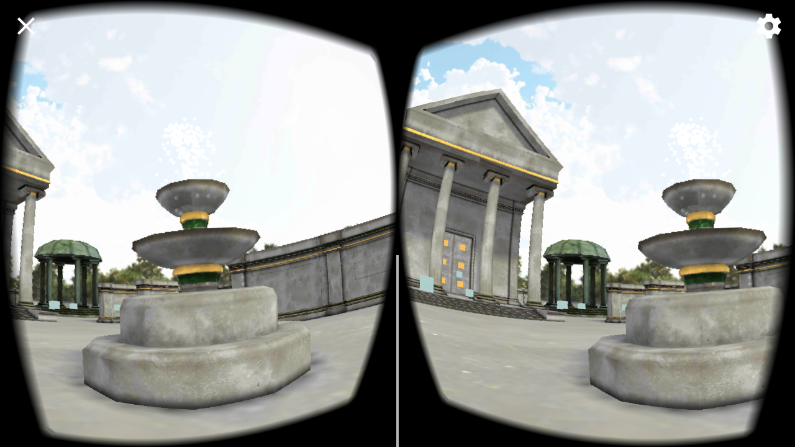

# A Maze Project

This project is part of [Udacity](https://www.udacity.com "Udacity - Be in demand")'s [VR Developer Nanodegree](https://www.udacity.com/course/vr-developer-nanodegree--nd017).

Built for an Android phone and a mobile VR headset like Google Cardboard.

Find your way around the maze I built, collect coins, marvel at statues and get the key to open the door. You can move around by clicking the floating cubes. Good luck!

If you'd like to try it out, download the "Build.zip" folder, extract the .apk file and add it to your Android phone (if you've never installed an app from outside the app store, here's some further guidance: https://www.cnet.com/how-to/how-to-install-apps-outside-of-google-play/).

## Versions
- Unity 2017.2.0f3
- GVR Unity SDK v1.120.0
I chose to upgrade to newer GVR due to bugs with the GVR Raycasters, which the newer releases have fixed.

## Assests used:
From Unity's Asset Store, enriching my maze, are:
- Julius Caesar Bust by SERGI NICOLÁS
- Lion Statue by ORGANICPOLYGONS
- Tree (Mediterranean) by IMMORTAL FACTORY
- Screaming statue by VSIFY
- Temple Props by THUNDERENT'S ASSETS
- Water Fx Particles by ALL VR EDUCATION
The background tune is "Sneaking/Night" from the Warped Fantasy Music Pack by ANDREW ISAIAS.

Many thanks to all the asset creators! <3
